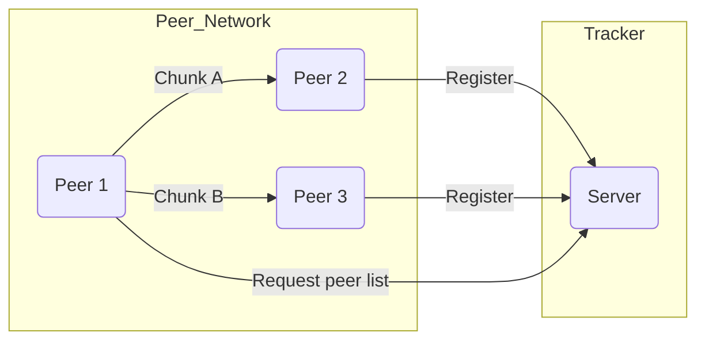

# Simple Torrent‑like Application (STA)

A lightweight peer‑to‑peer file‑sharing system built for the **Computer Networks** course (Semester 1 – AY 2024‑2025). The project re‑implements core BitTorrent concepts — a **central tracker**, **decentralised peers**, and **multi‑directional data transfer (MDDT)** — entirely in Python sockets and threads.

---

## 📚 Table of Contents
1. [Overview](#overview)  
2. [Key Features](#key-features)  
3. [System Architecture](#system-architecture)  
4. [Getting Started](#getting-started)  
5. [Project Structure](#project-structure)  
6. [Authors](#authors)  
7. [License](#license)

---

## Overview
The STA consists of **two core components**:  

| Component | Role |
|-----------|------|
| **Tracker** | Centralised metadata server. Maintains the list of active peers and the pieces they hold, and returns candidate peers to download from. |
| **Peers** | Nodes that register their file chunks with the tracker, then download / upload pieces to other peers concurrently. |

The application leverages **Multi‑Directional Data Transfer** so a file is downloaded in parallel from multiple sources, maximising throughput and resilience.

---

## Key Features
- **Peer‑to‑Peer File Sharing** – Decentralised nodes both consume and serve data.  
- **Multi‑Threaded Data Transfer (MDDT)** – Each peer spawns multiple threads to fetch file pieces simultaneously, drastically reducing download time.  
- **Scalable Tracker** – Keeps a dynamic registry of peers and files, supporting real‑time updates as peers join/leave.  
- **Interactive CLI** – Commands such as `start`, `update`, `request <filename>`, and `close` give users granular control of their sessions.  
- **Clear Class Design** – `Server`, `Peer`, `File`, and `Piece` classes isolate concerns for maintainability.  

---

## System Architecture


1. **Registration Phase** – Each peer announces the pieces it owns to the tracker.  
2. **Discovery Phase** – A leecher requests a file; the tracker replies with peers holding the required chunks.  
3. **Download Phase** – The leecher spawns threads to fetch pieces in parallel, reassembling them locally.  

---

## Getting Started

### Prerequisites
- Python **3.10+**

### Installation
```bash
git clone <your‑repo‑url>
cd sta
```

### Running the Application
1. **Start the tracker**  
   ```bash
   python tracker.py
   ```
2. **Start one or more peers** (use a new terminal per peer)  
   ```bash
   python peer.py
   ```
3. In each peer console:  
   ```
   start          # connect to tracker
   update         # fetch latest file list
   request hello_big.txt
   ```
4. Use `close` to gracefully disconnect.

---

## Project Structure
```
sta/
├─ tracker.py          # central metadata server
├─ peer.py             # peer node (client + mini server)
├─ utils/              # helper functions
├─ docs/               # assignment report & diagrams
└─ README.md
```

---

## Authors
| Name | Student ID |
|------|------------|
| **Huỳnh Gia Hưng** | 2252274 |

_Advisor: Diệp Thanh Đăng_

---

## License
This project is released for educational purposes under the **MIT License**. See `LICENSE` for details.
